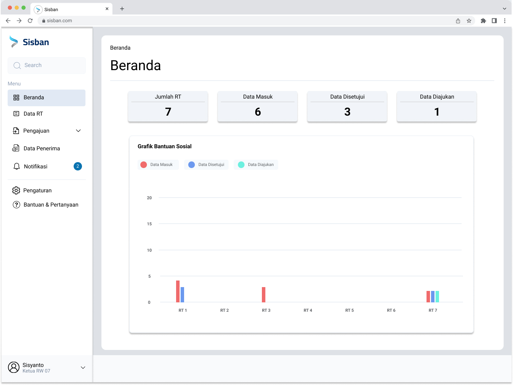
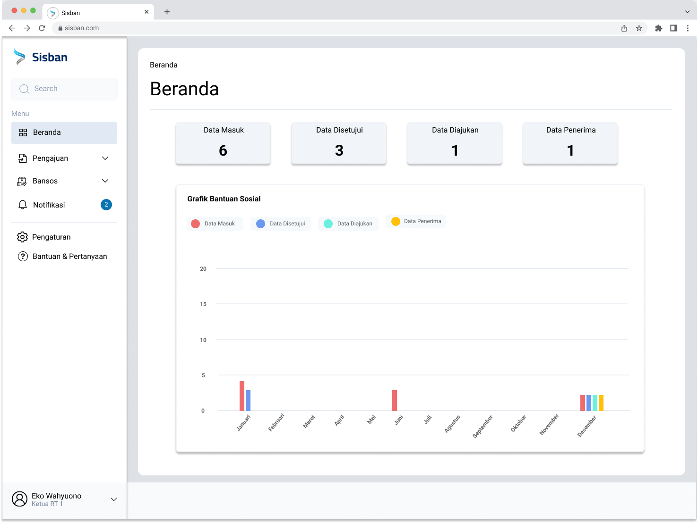
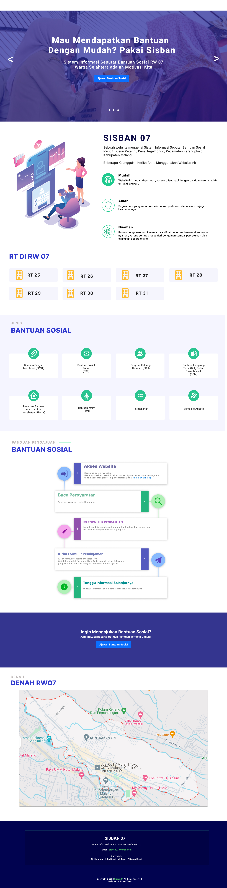
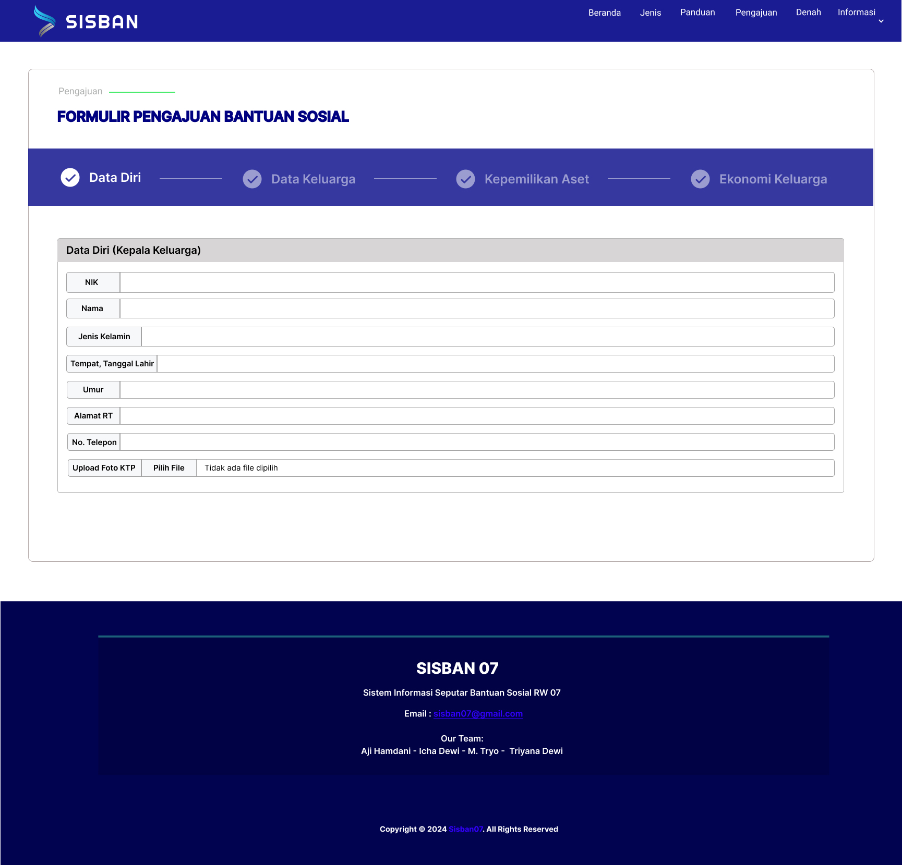

<!-- Heading -->

# Sistem Informasi Seputar Bantuan Sosial (SISBAN)

<!-- Overview about this project -->

In semester 4, we get a project to be able to help the surrounding rw in overcoming the problems that are there with an application of technology. for that we get advice from the rw chairman to make an application that can help in the management of social assistance recipients, so that it can also help in the process of determining the recipients of social assistance for residents in the rw.

Data management that is still done manually causes various problems, such as data inaccuracies, delays in aid distribution, and a high risk of errors. This manual process also hampers efficiency and transparency, which are essential for public trust in the social assistance system.

<!-- Group member's identity -->

### <u>Group Member : </u>

> 1. Aji Hamdani Ahmad
> 2. Icha Dewi Putriana
> 3. M. Tryo Bagus Anugrah Putra
> 4. Triyana Dewi Fathmawati

To achieve this goal of making application for helping data management social assistance recipients, we created a website for social assistance recipient management.

The first thing we do is analyze what needs are needed by the rw chairman or local residents that will be used on the website that we make later. After analyzing, we then make SRS (Software Requirement Specification). It contains several designs such as Application Flow Diagram (Activity Diagram, Sequence Diagram), Technical Diagram (Entity Relationship Diagram, Class Diagram) etc.<a href=".github/assets/docs/skpl.pdf" target="_blank">
View the document of Software Requirement Specification
</a>

Then we made a design for the user interface, which we needed help from the figma platform to make the design of the user interface.

Here are some designs of the application, you can also see it in full through the following link to [see full design]('https://figma.com)

    
    
    
    

After the user interface design was complete, we then started by migrating the database to make it easier to work as a team. The results of the migration can also be seen in the [following database directory](https://github.com/Danni4421/sisban/tree/production/database)

After the database is complete, we divide several tasks, some of which create functionality through the controller or can be said to make the backend part, there are also several people who do slicing for components that aim to implement the user interface design or can be said to be the frontend part.

After each part is complete, the next step is to integrate between the backend and frontend, the integration process we do some through AJAX requests, or through the request form.

And after all these processes we have finished building a website to be able to help the rw chairman in carrying out social assistance management as well as selecting social assistance recipients.

Here is a preview of the results of our website which can actually be seen through [sisban.biz.id](https://sisban.biz.id), but because we do not have enough funds to continue, so for now the domain cannot be accessed.

And here are the results of our website :
<a href=".github/assets/docs/user-manual.pdf" target="_blank">
Document User Manual
</a>
